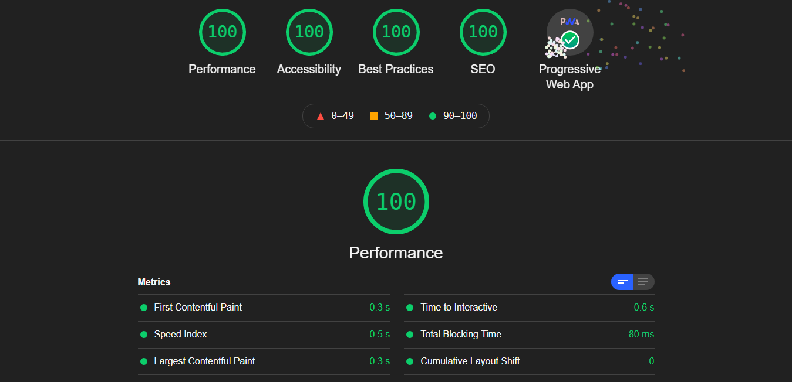

# Nuxt TypeScript starter template



A [Nuxt.js](https://github.com/nuxt/nuxt.js) + [@nuxt/typescript](https://github.com/nuxt/typescript) + [@nuxt/composition-api](https://github.com/nuxt-community/composition-api) starter project template.

## Deployment

```bash
# install dependencies
$ npm install

# serve with hot reload at localhost:3000
$ npm run dev

# build for production and launch server
$ npm run build
$ npm run start

# generate static project
$ npm run generate
```

Go to [http://localhost:3000](http://localhost:3000)

For detailed explanation on how things work, check out [Nuxt.js docs](https://nuxtjs.org).

## Features

- Typescript
- Composition API
- Vuex
- PWA

## Roadmap

[-] Add test (jest+cypress)

[-] Add docker support

## Acknowledgements

- [Create Nuxt App](https://github.com/nuxt/create-nuxt-app)
- [Nuxt Typescript Templates](https://github.com/nuxt-community/typescript-template)
- [Vuex + TypeScript](https://dev.to/3vilarthas/vuex-typescript-m4j)
- [The easiest way to create a README](https://readme.so/editor)

## License

[MIT](https://choosealicense.com/licenses/mit/)
